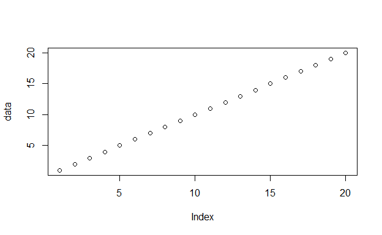
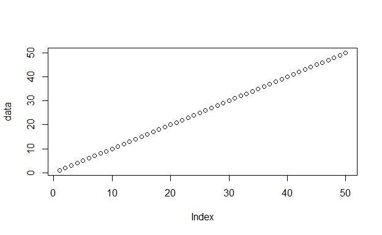
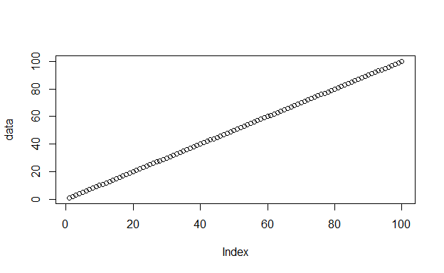

# Inital Data


<div class="layout-chunk" data-layout="l-body">
<details>
<summary>Show my code</summary>
<div class="sourceCode"><pre class="sourceCode r"><code class="sourceCode r"><span class='va'>data</span> <span class='op'>&lt;-</span> <span class='fu'><a href='https://rdrr.io/r/base/c.html'>c</a></span><span class='op'>(</span><span class='fl'>1</span><span class='op'>:</span><span class='fl'>20</span><span class='op'>)</span>
</code></pre></div>

</details>

</div>


<div class="layout-chunk" data-layout="l-body">
<div class="sourceCode"><pre class="sourceCode r"><code class="sourceCode r"><span class='fu'><a href='https://rdrr.io/r/graphics/plot.default.html'>plot</a></span><span class='op'>(</span><span class='va'>data</span><span class='op'>)</span>
</code></pre></div>
<!-- -->

</div>


## Testing Sub


<div class="layout-chunk" data-layout="l-body">
<div class="sourceCode"><pre class="sourceCode r"><code class="sourceCode r"><span class='va'>data</span> <span class='op'>&lt;-</span> <span class='fu'><a href='https://rdrr.io/r/base/c.html'>c</a></span><span class='op'>(</span><span class='fl'>1</span><span class='op'>:</span><span class='fl'>50</span><span class='op'>)</span>
</code></pre></div>

</div>


<div class="layout-chunk" data-layout="l-body">
<div class="sourceCode"><pre class="sourceCode r"><code class="sourceCode r"><span class='fu'><a href='https://rdrr.io/r/graphics/plot.default.html'>plot</a></span><span class='op'>(</span><span class='va'>data</span><span class='op'>)</span>
</code></pre></div>
<!-- -->

</div>


# Hopefully it works


<div class="layout-chunk" data-layout="l-body">
<div class="sourceCode"><pre class="sourceCode r"><code class="sourceCode r"><span class='va'>data</span> <span class='op'>&lt;-</span> <span class='fu'><a href='https://rdrr.io/r/base/c.html'>c</a></span><span class='op'>(</span><span class='fl'>1</span><span class='op'>:</span><span class='fl'>100</span><span class='op'>)</span>
</code></pre></div>

</div>


<div class="layout-chunk" data-layout="l-body">
<div class="sourceCode"><pre class="sourceCode r"><code class="sourceCode r"><span class='fu'><a href='https://rdrr.io/r/graphics/plot.default.html'>plot</a></span><span class='op'>(</span><span class='va'>data</span><span class='op'>)</span>
</code></pre></div>
<!-- -->

</div>


```{.r .distill-force-highlighting-css}
```
