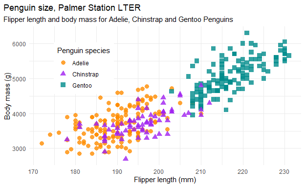
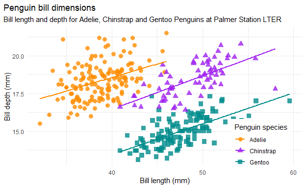
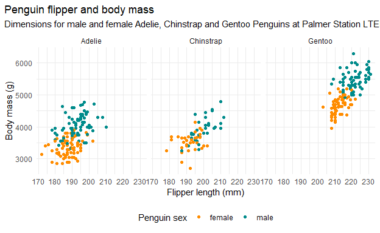
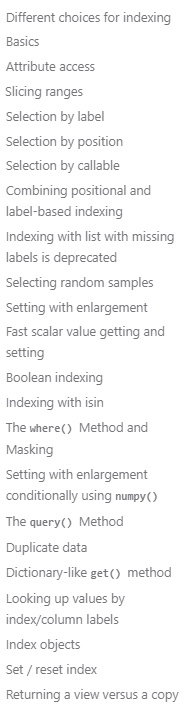

<!-- TOC JAVASCRIPT ELEMENTS -->

```{=html}
<script>
function toggle () {
  document.getElementById("TOC").classList.toggle("hide");
};

window.addEventListener('DOMContentLoaded', () => {

  const observer = new IntersectionObserver(entries => {
    entries.forEach(entry => {
      const id = entry.target.getAttribute('id');
      if (entry.intersectionRatio > 0) {
        document.querySelector(`[href="#${id}"]`).parentElement.classList.add('active');
      } else {
        document.querySelector(`[href="#${id}"]`).parentElement.classList.remove('active');
      }
    });
  });

  // Track all headings that have an `id` applied
  document.querySelectorAll('h1[id], h2[id], h3[id], h4[id], h5[id], h6[id]').forEach((h1, h2, h3, h4, h5, h6) => {
    observer.observe(h1, h2, h3, h4, h5, h6);
  });
  
});
</script>
```
<!-- TOC HTML ELEMENTS -->

<input type="button" class="d-article-with-toc" id="TOC" value="&#x2630" title="Toggle (Hide/Show) Table of Contents" alt="Toggle button for hiding/showing the Table of Contents" onclick="toggle()" style="padding:7px; border: 0px;"/>


# TLDR

Here are some points that I think pandas should work on to achieve it's vision of being the best data manipulation tool out there.

# Setup


## Link to the GitHub source code

<div class="layout-chunk" data-layout="l-body">

```{=html}
<a href="https://github.com/brunocarlin/carlin/blob/main/_posts/2022-02-28-pandaswishes/pandaswishes.Rmd">
<button class="btn btn-default"><i class="fa fa-github"></i> See the source rmd file</button>
</a>
```

</div>


## Libraries in R

<div class="layout-chunk" data-layout="l-body">
<div class="sourceCode"><pre class="sourceCode r"><code class="sourceCode r"><span class='kw'><a href='https://rdrr.io/r/base/library.html'>library</a></span><span class='op'>(</span><span class='va'><a href='https://tidyverse.tidyverse.org'>tidyverse</a></span><span class='op'>)</span>
<span class='kw'><a href='https://rdrr.io/r/base/library.html'>library</a></span><span class='op'>(</span><span class='va'><a href='https://r-datatable.com'>data.table</a></span><span class='op'>)</span>
</code></pre></div>

</div>


## Libraries in Python

<div class="layout-chunk" data-layout="l-body">

```python
import pandas as pd
import numpy as np
```

</div>


## The Data: Penguins!

[Horst AM, Hill AP, Gorman KB (2020). palmerpenguins: Palmer Archipelago (Antarctica) penguin data. R package version 0.1.0. https://allisonhorst.github.io/palmerpenguins/](https://github.com/allisonhorst/palmerpenguins/)

I choose the Palmer Penguins Dataset. Some call it the new iris after the iris dataset was rightly criticized for Eugenics issues. You can read more about it here [Iris dataset retirement](https://armchairecology.blog/iris-dataset/).

### What does the dataset look like?

<div class="layout-chunk" data-layout="l-body">
<div class="sourceCode"><pre class="sourceCode r"><code class="sourceCode r"><span class='va'>penguins</span> <span class='op'>&lt;-</span> <span class='fu'>palmerpenguins</span><span class='fu'>::</span><span class='va'><a href='https://allisonhorst.github.io/palmerpenguins/reference/penguins.html'>penguins</a></span>

<span class='fu'><a href='https://rdrr.io/r/utils/head.html'>head</a></span><span class='op'>(</span><span class='va'>penguins</span><span class='op'>)</span>
</code></pre></div>

```
# A tibble: 6 x 8
  species island    bill_length_mm bill_depth_mm flipper_length_mm
  <fct>   <fct>              <dbl>         <dbl>             <int>
1 Adelie  Torgersen           39.1          18.7               181
2 Adelie  Torgersen           39.5          17.4               186
3 Adelie  Torgersen           40.3          18                 195
4 Adelie  Torgersen           NA            NA                  NA
5 Adelie  Torgersen           36.7          19.3               193
6 Adelie  Torgersen           39.3          20.6               190
# ... with 3 more variables: body_mass_g <int>, sex <fct>, year <int>
```

<div class="sourceCode"><pre class="sourceCode r"><code class="sourceCode r"><span class='fu'><a href='https://pillar.r-lib.org/reference/glimpse.html'>glimpse</a></span><span class='op'>(</span><span class='va'>penguins</span>,width <span class='op'>=</span> <span class='fl'>50</span><span class='op'>)</span>
</code></pre></div>

```
Rows: 344
Columns: 8
$ species           <fct> Adelie, Adelie, Adelie~
$ island            <fct> Torgersen, Torgersen, ~
$ bill_length_mm    <dbl> 39.1, 39.5, 40.3, NA, ~
$ bill_depth_mm     <dbl> 18.7, 17.4, 18.0, NA, ~
$ flipper_length_mm <int> 181, 186, 195, NA, 193~
$ body_mass_g       <int> 3750, 3800, 3250, NA, ~
$ sex               <fct> male, female, female, ~
$ year              <int> 2007, 2007, 2007, 2007~
```

</div>


The dataset consists of 344 samples of three species of Penguins.

### How do they look like?

The three species have different characteristics.


And what the hell is Bill Lenght and Depth?


### Interaction among variables and species

[Credit to Allison once again](https://allisonhorst.github.io/palmerpenguins/articles/examples.html)

#### Penguin mass vs. flipper length

<div class="layout-chunk" data-layout="l-body">
<!-- -->

</div>


As expected from the picture, the Gento species is a bit bigger, and we can see a heavy correlation between Flipper length and weight.

#### Bill length vs. depth

<div class="layout-chunk" data-layout="l-body">
<!-- -->

</div>


As we saw in the picture, the Adelie has smaller-length Bills.  
The Gentoo has much more elongated ones than the Adelie, but they look 'flatter,' what the dataset quantifies as a smaller Bill depth.  
The Chinstrap are positioned on the bigger side of both metrics.

#### Impact of sex on size

<div class="layout-chunk" data-layout="l-body">
<!-- -->

</div>


# My experience

At this point, I have worked more than 4 years with both Python and R, Python has been my language choice when interacting with colleges simply because of culture or better support in platforms such as AWS, but it is relevant to understand that R was my first data language (I dabbled in some Macros on excel before) and I have used it since graduation more than 7 years ago.

# The tasks of pandas framework?

Firstly, I call it a framework because pandas comes bundled with NumPy and other friends like matplot or seaborn. It is fair to compare them as a bundle since the competition is also split among many packages. I will borrow a picture from the tidyverse to explain where pandas stands on the analysis workflow.


pandas Is responsible for the Import -\> Tidy -\> Transform part

But it can sometimes reach a little bit into Visualize by delegating when necessary. If your communication task is a graph, you can use matplot or seaborn, and there are also some simple APIs inside pandas that can plot basic graphs.

If you are importing from parquet, sometimes pandas calls on the arrow package.

There are many other examples, but I think of pandas as this central player on the data workflow of the Python ecosystem, it is unmatched in its amount of methods, and therefore it should be expected that some things could use some improvement, and that is the point of this post, I want pandas to change for the better, I want to discuss why pandas is in this state of right now and what I would like to see instead.

# The current landscape

In R, I have used three different frameworks when dealing with data that can be considered a problem. Still, there is a crucial difference when comparing Python and R, you will usually find competition inside R, and it happens on every sphere.

Modeling tidymodels vs. mlr.  
Visualization plotly vs. ggplot2.  
Statistical tests sometimes have tens of different implementations from all over the world.    

There are many other examples, and as an economist, I see this competition with good eyes. The competition has fostered fast and tested change on multiple instances as competing.

## The timeline

I use the dates from pip and cran, but most packages get released earlier on mailing lists or private repos.

<div class="layout-chunk" data-layout="l-body">

```{=html}
<div id="htmlwidget-65b9b21335564a610c61" style="width:624px;height:384px;" class="plotly html-widget"></div>
<script type="application/json" data-for="htmlwidget-65b9b21335564a610c61">{"x":{"visdat":{"6fa028a7328d":["function () ","plotlyVisDat"]},"cur_data":"6fa028a7328d","attrs":{"6fa028a7328d":{"mode":"lines","alpha_stroke":1,"sizes":[10,100],"spans":[1,20],"type":"scatter"},"6fa028a7328d.1":{"mode":"lines","alpha_stroke":1,"sizes":[10,100],"spans":[1,20],"type":"scatter","x":["2009-12-25 00:00:00.000000","2020-01-30 00:00:00.000000"],"y":9,"line":{"color":"d10682","width":33.3333333333333},"showlegend":false,"hoverinfo":"text","text":"<b><1<\/b><br>from <b>2009-12-25<\/b> to <b>2020-01-30<\/b>","inherit":true},"6fa028a7328d.2":{"mode":"text","alpha_stroke":1,"sizes":[10,100],"spans":[1,20],"type":"scatter","x":"2015-01-12 00:30:00.000000","y":9,"text":"<1","textfont":{"family":"Arial","size":14,"color":"rgba(255,255,255,1)"},"textposition":"center","showlegend":false,"hoverinfo":"none","inherit":true},"6fa028a7328d.3":{"mode":"lines","alpha_stroke":1,"sizes":[10,100],"spans":[1,20],"type":"scatter","x":["2020-01-30 00:00:00.000000","2022-03-01 00:00:00.000000"],"y":9,"line":{"color":"130654","width":33.3333333333333},"showlegend":false,"hoverinfo":"text","text":"<b>>1<\/b><br>from <b>2020-01-30<\/b> to <b>2022-03-01<\/b>","inherit":true},"6fa028a7328d.4":{"mode":"text","alpha_stroke":1,"sizes":[10,100],"spans":[1,20],"type":"scatter","x":"2021-02-13 12:00:00.000000","y":9,"text":">1","textfont":{"family":"Arial","size":14,"color":"rgba(255,255,255,1)"},"textposition":"center","showlegend":false,"hoverinfo":"none","inherit":true},"6fa028a7328d.5":{"mode":"lines","alpha_stroke":1,"sizes":[10,100],"spans":[1,20],"type":"scatter","x":["2014-01-29 00:00:00.000000","2020-05-29 00:00:00.000000"],"y":7,"line":{"color":"ffb851","width":33.3333333333333},"showlegend":false,"hoverinfo":"text","text":"<b><1<\/b><br>from <b>2014-01-29<\/b> to <b>2020-05-29<\/b>","inherit":true},"6fa028a7328d.6":{"mode":"text","alpha_stroke":1,"sizes":[10,100],"spans":[1,20],"type":"scatter","x":"2017-03-29 23:30:00.000000","y":7,"text":"<1","textfont":{"family":"Arial","size":14,"color":"rgba(255,255,255,1)"},"textposition":"center","showlegend":false,"hoverinfo":"none","inherit":true},"6fa028a7328d.7":{"mode":"lines","alpha_stroke":1,"sizes":[10,100],"spans":[1,20],"type":"scatter","x":["2020-05-29 00:00:00.000000","2022-03-01 00:00:00.000000"],"y":7,"line":{"color":"6cb3e0","width":33.3333333333333},"showlegend":false,"hoverinfo":"text","text":"<b>>1<\/b><br>from <b>2020-05-29<\/b> to <b>2022-03-01<\/b>","inherit":true},"6fa028a7328d.8":{"mode":"text","alpha_stroke":1,"sizes":[10,100],"spans":[1,20],"type":"scatter","x":"2021-04-14 12:00:00.000000","y":7,"text":">1","textfont":{"family":"Arial","size":14,"color":"rgba(255,255,255,1)"},"textposition":"center","showlegend":false,"hoverinfo":"none","inherit":true},"6fa028a7328d.9":{"mode":"lines","alpha_stroke":1,"sizes":[10,100],"spans":[1,20],"type":"scatter","x":["2006-04-15 00:00:00.000000","2022-03-01 00:00:00.000000"],"y":5,"line":{"color":"ffff4d","width":33.3333333333333},"showlegend":false,"hoverinfo":"text","text":"<b>>1<\/b><br>from <b>2006-04-15<\/b> to <b>2022-03-01<\/b>","inherit":true},"6fa028a7328d.10":{"mode":"text","alpha_stroke":1,"sizes":[10,100],"spans":[1,20],"type":"scatter","x":"2014-03-23 12:00:00.000000","y":5,"text":">1","textfont":{"family":"Arial","size":14,"color":"rgba(0,0,0,1)"},"textposition":"center","showlegend":false,"hoverinfo":"none","inherit":true},"6fa028a7328d.11":{"mode":"lines","alpha_stroke":1,"sizes":[10,100],"spans":[1,20],"type":"scatter","x":["1997-04-01 00:00:00.000000","2000-02-29 00:00:00.000000"],"y":3,"line":{"color":"EFF3FF","width":33.3333333333333},"showlegend":false,"hoverinfo":"text","text":"<b>0<\/b><br>from <b>1997-04-01<\/b> to <b>2000-02-29<\/b>","inherit":true},"6fa028a7328d.12":{"mode":"text","alpha_stroke":1,"sizes":[10,100],"spans":[1,20],"type":"scatter","x":"1998-09-15 00:00:00.000000","y":3,"text":"0","textfont":{"family":"Arial","size":14,"color":"rgba(255,255,255,1)"},"textposition":"center","showlegend":false,"hoverinfo":"none","inherit":true},"6fa028a7328d.13":{"mode":"lines","alpha_stroke":1,"sizes":[10,100],"spans":[1,20],"type":"scatter","x":["2000-02-29 00:00:00.000000","2004-10-04 00:00:00.000000"],"y":3,"line":{"color":"BDD7E7","width":33.3333333333333},"showlegend":false,"hoverinfo":"text","text":"<b>1<\/b><br>from <b>2000-02-29<\/b> to <b>2004-10-04<\/b>","inherit":true},"6fa028a7328d.14":{"mode":"text","alpha_stroke":1,"sizes":[10,100],"spans":[1,20],"type":"scatter","x":"2002-06-17 12:00:00.000000","y":3,"text":"1","textfont":{"family":"Arial","size":14,"color":"rgba(255,255,255,1)"},"textposition":"center","showlegend":false,"hoverinfo":"none","inherit":true},"6fa028a7328d.15":{"mode":"lines","alpha_stroke":1,"sizes":[10,100],"spans":[1,20],"type":"scatter","x":["2004-10-04 00:00:00.000000","2013-04-03 00:00:00.000000"],"y":3,"line":{"color":"6BAED6","width":33.3333333333333},"showlegend":false,"hoverinfo":"text","text":"<b>2<\/b><br>from <b>2004-10-04<\/b> to <b>2013-04-03<\/b>","inherit":true},"6fa028a7328d.16":{"mode":"text","alpha_stroke":1,"sizes":[10,100],"spans":[1,20],"type":"scatter","x":"2009-01-02 13:00:00.000000","y":3,"text":"2","textfont":{"family":"Arial","size":14,"color":"rgba(255,255,255,1)"},"textposition":"center","showlegend":false,"hoverinfo":"none","inherit":true},"6fa028a7328d.17":{"mode":"lines","alpha_stroke":1,"sizes":[10,100],"spans":[1,20],"type":"scatter","x":["2013-04-03 00:00:00.000000","2020-04-24 00:00:00.000000"],"y":3,"line":{"color":"3182BD","width":33.3333333333333},"showlegend":false,"hoverinfo":"text","text":"<b>3<\/b><br>from <b>2013-04-03<\/b> to <b>2020-04-24<\/b>","inherit":true},"6fa028a7328d.18":{"mode":"text","alpha_stroke":1,"sizes":[10,100],"spans":[1,20],"type":"scatter","x":"2016-10-13 00:00:00.000000","y":3,"text":"3","textfont":{"family":"Arial","size":14,"color":"rgba(255,255,255,1)"},"textposition":"center","showlegend":false,"hoverinfo":"none","inherit":true},"6fa028a7328d.19":{"mode":"lines","alpha_stroke":1,"sizes":[10,100],"spans":[1,20],"type":"scatter","x":["2020-04-24 00:00:00.000000","2022-03-01 00:00:00.000000"],"y":3,"line":{"color":"08519C","width":33.3333333333333},"showlegend":false,"hoverinfo":"text","text":"<b>4<\/b><br>from <b>2020-04-24<\/b> to <b>2022-03-01<\/b>","inherit":true},"6fa028a7328d.20":{"mode":"text","alpha_stroke":1,"sizes":[10,100],"spans":[1,20],"type":"scatter","x":"2021-03-28 00:00:00.000000","y":3,"text":"4","textfont":{"family":"Arial","size":14,"color":"rgba(255,255,255,1)"},"textposition":"center","showlegend":false,"hoverinfo":"none","inherit":true},"6fa028a7328d.21":{"mode":"lines","alpha_stroke":1,"sizes":[10,100],"spans":[1,20],"type":"scatter","x":["2019-04-19 00:00:00.000000","2021-10-18 00:00:00.000000"],"y":1,"line":{"color":"a34316","width":33.3333333333333},"showlegend":false,"hoverinfo":"text","text":"<b>Koalas<\/b><br>from <b>2019-04-19<\/b> to <b>2021-10-18<\/b>","inherit":true},"6fa028a7328d.22":{"mode":"text","alpha_stroke":1,"sizes":[10,100],"spans":[1,20],"type":"scatter","x":"2020-07-18 12:00:00.000000","y":1,"text":"Koalas","textfont":{"family":"Arial","size":14,"color":"rgba(58,56,61,1)"},"textposition":"center","showlegend":false,"hoverinfo":"none","inherit":true},"6fa028a7328d.23":{"mode":"lines","alpha_stroke":1,"sizes":[10,100],"spans":[1,20],"type":"scatter","x":["2021-10-18 00:00:00.000000","2022-03-01 00:00:00.000000"],"y":1,"line":{"color":"d7591e","width":33.3333333333333},"showlegend":false,"hoverinfo":"text","text":"<b>api<\/b><br>from <b>2021-10-18<\/b> to <b>2022-03-01<\/b>","inherit":true},"6fa028a7328d.24":{"mode":"text","alpha_stroke":1,"sizes":[10,100],"spans":[1,20],"type":"scatter","x":"2021-12-24 00:00:00.000000","y":1,"text":"api","textfont":{"family":"Arial","size":14,"color":"rgba(58,56,61,1)"},"textposition":"center","showlegend":false,"hoverinfo":"none","inherit":true}},"layout":{"margin":{"b":40,"l":60,"t":25,"r":10},"hovermode":"closest","plot_bgcolor":"#FCFCFC","shapes":[{"type":"line","x0":0,"x1":1,"xref":"paper","y0":2,"y1":2,"line":{"color":"grey65","width":0.5}},{"type":"line","x0":0,"x1":1,"xref":"paper","y0":4,"y1":4,"line":{"color":"grey65","width":0.5}},{"type":"line","x0":0,"x1":1,"xref":"paper","y0":6,"y1":6,"line":{"color":"grey65","width":0.5}},{"type":"line","x0":0,"x1":1,"xref":"paper","y0":8,"y1":8,"line":{"color":"grey65","width":0.5}}],"xaxis":{"domain":[0,1],"automargin":true,"linewidth":1,"mirror":true,"showgrid":true,"gridcolor":"grey90","title":""},"yaxis":{"domain":[0,1],"automargin":true,"linewidth":1,"mirror":true,"range":[0,10],"showgrid":false,"title":"","tickmode":"array","tickvals":[9,7,5,3,1],"ticktext":["pandas","dplyr","data.table","Base R","Spark"]},"showlegend":false},"source":"A","config":{"modeBarButtonsToAdd":["hoverclosest","hovercompare"],"showSendToCloud":false},"data":[{"mode":"lines","type":"scatter","marker":{"color":"rgba(31,119,180,1)","line":{"color":"rgba(31,119,180,1)"}},"error_y":{"color":"rgba(31,119,180,1)"},"error_x":{"color":"rgba(31,119,180,1)"},"line":{"color":"rgba(31,119,180,1)"},"xaxis":"x","yaxis":"y","frame":null},{"mode":"lines","type":"scatter","x":["2009-12-25 00:00:00.000000","2020-01-30 00:00:00.000000"],"y":[9,9],"line":{"color":"d10682","width":33.3333333333333},"showlegend":false,"hoverinfo":["text","text"],"text":["<b><1<\/b><br>from <b>2009-12-25<\/b> to <b>2020-01-30<\/b>","<b><1<\/b><br>from <b>2009-12-25<\/b> to <b>2020-01-30<\/b>"],"marker":{"color":"rgba(255,127,14,1)","line":{"color":"rgba(255,127,14,1)"}},"error_y":{"color":"rgba(255,127,14,1)"},"error_x":{"color":"rgba(255,127,14,1)"},"xaxis":"x","yaxis":"y","frame":null},{"mode":"text","type":"scatter","x":["2015-01-12 00:30:00.000000"],"y":[9],"text":"<1","textfont":{"family":"Arial","size":14,"color":"rgba(255,255,255,1)"},"textposition":"center","showlegend":false,"hoverinfo":"none","marker":{"color":"rgba(44,160,44,1)","line":{"color":"rgba(44,160,44,1)"}},"error_y":{"color":"rgba(44,160,44,1)"},"error_x":{"color":"rgba(44,160,44,1)"},"line":{"color":"rgba(44,160,44,1)"},"xaxis":"x","yaxis":"y","frame":null},{"mode":"lines","type":"scatter","x":["2020-01-30 00:00:00.000000","2022-03-01 00:00:00.000000"],"y":[9,9],"line":{"color":"130654","width":33.3333333333333},"showlegend":false,"hoverinfo":["text","text"],"text":["<b>>1<\/b><br>from <b>2020-01-30<\/b> to <b>2022-03-01<\/b>","<b>>1<\/b><br>from <b>2020-01-30<\/b> to <b>2022-03-01<\/b>"],"marker":{"color":"rgba(214,39,40,1)","line":{"color":"rgba(214,39,40,1)"}},"error_y":{"color":"rgba(214,39,40,1)"},"error_x":{"color":"rgba(214,39,40,1)"},"xaxis":"x","yaxis":"y","frame":null},{"mode":"text","type":"scatter","x":["2021-02-13 12:00:00.000000"],"y":[9],"text":">1","textfont":{"family":"Arial","size":14,"color":"rgba(255,255,255,1)"},"textposition":"center","showlegend":false,"hoverinfo":"none","marker":{"color":"rgba(148,103,189,1)","line":{"color":"rgba(148,103,189,1)"}},"error_y":{"color":"rgba(148,103,189,1)"},"error_x":{"color":"rgba(148,103,189,1)"},"line":{"color":"rgba(148,103,189,1)"},"xaxis":"x","yaxis":"y","frame":null},{"mode":"lines","type":"scatter","x":["2014-01-29 00:00:00.000000","2020-05-29 00:00:00.000000"],"y":[7,7],"line":{"color":"ffb851","width":33.3333333333333},"showlegend":false,"hoverinfo":["text","text"],"text":["<b><1<\/b><br>from <b>2014-01-29<\/b> to <b>2020-05-29<\/b>","<b><1<\/b><br>from <b>2014-01-29<\/b> to <b>2020-05-29<\/b>"],"marker":{"color":"rgba(140,86,75,1)","line":{"color":"rgba(140,86,75,1)"}},"error_y":{"color":"rgba(140,86,75,1)"},"error_x":{"color":"rgba(140,86,75,1)"},"xaxis":"x","yaxis":"y","frame":null},{"mode":"text","type":"scatter","x":["2017-03-29 23:30:00.000000"],"y":[7],"text":"<1","textfont":{"family":"Arial","size":14,"color":"rgba(255,255,255,1)"},"textposition":"center","showlegend":false,"hoverinfo":"none","marker":{"color":"rgba(227,119,194,1)","line":{"color":"rgba(227,119,194,1)"}},"error_y":{"color":"rgba(227,119,194,1)"},"error_x":{"color":"rgba(227,119,194,1)"},"line":{"color":"rgba(227,119,194,1)"},"xaxis":"x","yaxis":"y","frame":null},{"mode":"lines","type":"scatter","x":["2020-05-29 00:00:00.000000","2022-03-01 00:00:00.000000"],"y":[7,7],"line":{"color":"6cb3e0","width":33.3333333333333},"showlegend":false,"hoverinfo":["text","text"],"text":["<b>>1<\/b><br>from <b>2020-05-29<\/b> to <b>2022-03-01<\/b>","<b>>1<\/b><br>from <b>2020-05-29<\/b> to <b>2022-03-01<\/b>"],"marker":{"color":"rgba(127,127,127,1)","line":{"color":"rgba(127,127,127,1)"}},"error_y":{"color":"rgba(127,127,127,1)"},"error_x":{"color":"rgba(127,127,127,1)"},"xaxis":"x","yaxis":"y","frame":null},{"mode":"text","type":"scatter","x":["2021-04-14 12:00:00.000000"],"y":[7],"text":">1","textfont":{"family":"Arial","size":14,"color":"rgba(255,255,255,1)"},"textposition":"center","showlegend":false,"hoverinfo":"none","marker":{"color":"rgba(188,189,34,1)","line":{"color":"rgba(188,189,34,1)"}},"error_y":{"color":"rgba(188,189,34,1)"},"error_x":{"color":"rgba(188,189,34,1)"},"line":{"color":"rgba(188,189,34,1)"},"xaxis":"x","yaxis":"y","frame":null},{"mode":"lines","type":"scatter","x":["2006-04-15 00:00:00.000000","2022-03-01 00:00:00.000000"],"y":[5,5],"line":{"color":"ffff4d","width":33.3333333333333},"showlegend":false,"hoverinfo":["text","text"],"text":["<b>>1<\/b><br>from <b>2006-04-15<\/b> to <b>2022-03-01<\/b>","<b>>1<\/b><br>from <b>2006-04-15<\/b> to <b>2022-03-01<\/b>"],"marker":{"color":"rgba(23,190,207,1)","line":{"color":"rgba(23,190,207,1)"}},"error_y":{"color":"rgba(23,190,207,1)"},"error_x":{"color":"rgba(23,190,207,1)"},"xaxis":"x","yaxis":"y","frame":null},{"mode":"text","type":"scatter","x":["2014-03-23 12:00:00.000000"],"y":[5],"text":">1","textfont":{"family":"Arial","size":14,"color":"rgba(0,0,0,1)"},"textposition":"center","showlegend":false,"hoverinfo":"none","marker":{"color":"rgba(31,119,180,1)","line":{"color":"rgba(31,119,180,1)"}},"error_y":{"color":"rgba(31,119,180,1)"},"error_x":{"color":"rgba(31,119,180,1)"},"line":{"color":"rgba(31,119,180,1)"},"xaxis":"x","yaxis":"y","frame":null},{"mode":"lines","type":"scatter","x":["1997-04-01 00:00:00.000000","2000-02-29 00:00:00.000000"],"y":[3,3],"line":{"color":"EFF3FF","width":33.3333333333333},"showlegend":false,"hoverinfo":["text","text"],"text":["<b>0<\/b><br>from <b>1997-04-01<\/b> to <b>2000-02-29<\/b>","<b>0<\/b><br>from <b>1997-04-01<\/b> to <b>2000-02-29<\/b>"],"marker":{"color":"rgba(255,127,14,1)","line":{"color":"rgba(255,127,14,1)"}},"error_y":{"color":"rgba(255,127,14,1)"},"error_x":{"color":"rgba(255,127,14,1)"},"xaxis":"x","yaxis":"y","frame":null},{"mode":"text","type":"scatter","x":["1998-09-15 00:00:00.000000"],"y":[3],"text":"0","textfont":{"family":"Arial","size":14,"color":"rgba(255,255,255,1)"},"textposition":"center","showlegend":false,"hoverinfo":"none","marker":{"color":"rgba(44,160,44,1)","line":{"color":"rgba(44,160,44,1)"}},"error_y":{"color":"rgba(44,160,44,1)"},"error_x":{"color":"rgba(44,160,44,1)"},"line":{"color":"rgba(44,160,44,1)"},"xaxis":"x","yaxis":"y","frame":null},{"mode":"lines","type":"scatter","x":["2000-02-29 00:00:00.000000","2004-10-04 00:00:00.000000"],"y":[3,3],"line":{"color":"BDD7E7","width":33.3333333333333},"showlegend":false,"hoverinfo":["text","text"],"text":["<b>1<\/b><br>from <b>2000-02-29<\/b> to <b>2004-10-04<\/b>","<b>1<\/b><br>from <b>2000-02-29<\/b> to <b>2004-10-04<\/b>"],"marker":{"color":"rgba(214,39,40,1)","line":{"color":"rgba(214,39,40,1)"}},"error_y":{"color":"rgba(214,39,40,1)"},"error_x":{"color":"rgba(214,39,40,1)"},"xaxis":"x","yaxis":"y","frame":null},{"mode":"text","type":"scatter","x":["2002-06-17 12:00:00.000000"],"y":[3],"text":"1","textfont":{"family":"Arial","size":14,"color":"rgba(255,255,255,1)"},"textposition":"center","showlegend":false,"hoverinfo":"none","marker":{"color":"rgba(148,103,189,1)","line":{"color":"rgba(148,103,189,1)"}},"error_y":{"color":"rgba(148,103,189,1)"},"error_x":{"color":"rgba(148,103,189,1)"},"line":{"color":"rgba(148,103,189,1)"},"xaxis":"x","yaxis":"y","frame":null},{"mode":"lines","type":"scatter","x":["2004-10-04 00:00:00.000000","2013-04-03 00:00:00.000000"],"y":[3,3],"line":{"color":"6BAED6","width":33.3333333333333},"showlegend":false,"hoverinfo":["text","text"],"text":["<b>2<\/b><br>from <b>2004-10-04<\/b> to <b>2013-04-03<\/b>","<b>2<\/b><br>from <b>2004-10-04<\/b> to <b>2013-04-03<\/b>"],"marker":{"color":"rgba(140,86,75,1)","line":{"color":"rgba(140,86,75,1)"}},"error_y":{"color":"rgba(140,86,75,1)"},"error_x":{"color":"rgba(140,86,75,1)"},"xaxis":"x","yaxis":"y","frame":null},{"mode":"text","type":"scatter","x":["2009-01-02 13:00:00.000000"],"y":[3],"text":"2","textfont":{"family":"Arial","size":14,"color":"rgba(255,255,255,1)"},"textposition":"center","showlegend":false,"hoverinfo":"none","marker":{"color":"rgba(227,119,194,1)","line":{"color":"rgba(227,119,194,1)"}},"error_y":{"color":"rgba(227,119,194,1)"},"error_x":{"color":"rgba(227,119,194,1)"},"line":{"color":"rgba(227,119,194,1)"},"xaxis":"x","yaxis":"y","frame":null},{"mode":"lines","type":"scatter","x":["2013-04-03 00:00:00.000000","2020-04-24 00:00:00.000000"],"y":[3,3],"line":{"color":"3182BD","width":33.3333333333333},"showlegend":false,"hoverinfo":["text","text"],"text":["<b>3<\/b><br>from <b>2013-04-03<\/b> to <b>2020-04-24<\/b>","<b>3<\/b><br>from <b>2013-04-03<\/b> to <b>2020-04-24<\/b>"],"marker":{"color":"rgba(127,127,127,1)","line":{"color":"rgba(127,127,127,1)"}},"error_y":{"color":"rgba(127,127,127,1)"},"error_x":{"color":"rgba(127,127,127,1)"},"xaxis":"x","yaxis":"y","frame":null},{"mode":"text","type":"scatter","x":["2016-10-13 00:00:00.000000"],"y":[3],"text":"3","textfont":{"family":"Arial","size":14,"color":"rgba(255,255,255,1)"},"textposition":"center","showlegend":false,"hoverinfo":"none","marker":{"color":"rgba(188,189,34,1)","line":{"color":"rgba(188,189,34,1)"}},"error_y":{"color":"rgba(188,189,34,1)"},"error_x":{"color":"rgba(188,189,34,1)"},"line":{"color":"rgba(188,189,34,1)"},"xaxis":"x","yaxis":"y","frame":null},{"mode":"lines","type":"scatter","x":["2020-04-24 00:00:00.000000","2022-03-01 00:00:00.000000"],"y":[3,3],"line":{"color":"08519C","width":33.3333333333333},"showlegend":false,"hoverinfo":["text","text"],"text":["<b>4<\/b><br>from <b>2020-04-24<\/b> to <b>2022-03-01<\/b>","<b>4<\/b><br>from <b>2020-04-24<\/b> to <b>2022-03-01<\/b>"],"marker":{"color":"rgba(23,190,207,1)","line":{"color":"rgba(23,190,207,1)"}},"error_y":{"color":"rgba(23,190,207,1)"},"error_x":{"color":"rgba(23,190,207,1)"},"xaxis":"x","yaxis":"y","frame":null},{"mode":"text","type":"scatter","x":["2021-03-28 00:00:00.000000"],"y":[3],"text":"4","textfont":{"family":"Arial","size":14,"color":"rgba(255,255,255,1)"},"textposition":"center","showlegend":false,"hoverinfo":"none","marker":{"color":"rgba(31,119,180,1)","line":{"color":"rgba(31,119,180,1)"}},"error_y":{"color":"rgba(31,119,180,1)"},"error_x":{"color":"rgba(31,119,180,1)"},"line":{"color":"rgba(31,119,180,1)"},"xaxis":"x","yaxis":"y","frame":null},{"mode":"lines","type":"scatter","x":["2019-04-19 00:00:00.000000","2021-10-18 00:00:00.000000"],"y":[1,1],"line":{"color":"a34316","width":33.3333333333333},"showlegend":false,"hoverinfo":["text","text"],"text":["<b>Koalas<\/b><br>from <b>2019-04-19<\/b> to <b>2021-10-18<\/b>","<b>Koalas<\/b><br>from <b>2019-04-19<\/b> to <b>2021-10-18<\/b>"],"marker":{"color":"rgba(255,127,14,1)","line":{"color":"rgba(255,127,14,1)"}},"error_y":{"color":"rgba(255,127,14,1)"},"error_x":{"color":"rgba(255,127,14,1)"},"xaxis":"x","yaxis":"y","frame":null},{"mode":"text","type":"scatter","x":["2020-07-18 12:00:00.000000"],"y":[1],"text":"Koalas","textfont":{"family":"Arial","size":14,"color":"rgba(58,56,61,1)"},"textposition":"center","showlegend":false,"hoverinfo":"none","marker":{"color":"rgba(44,160,44,1)","line":{"color":"rgba(44,160,44,1)"}},"error_y":{"color":"rgba(44,160,44,1)"},"error_x":{"color":"rgba(44,160,44,1)"},"line":{"color":"rgba(44,160,44,1)"},"xaxis":"x","yaxis":"y","frame":null},{"mode":"lines","type":"scatter","x":["2021-10-18 00:00:00.000000","2022-03-01 00:00:00.000000"],"y":[1,1],"line":{"color":"d7591e","width":33.3333333333333},"showlegend":false,"hoverinfo":["text","text"],"text":["<b>api<\/b><br>from <b>2021-10-18<\/b> to <b>2022-03-01<\/b>","<b>api<\/b><br>from <b>2021-10-18<\/b> to <b>2022-03-01<\/b>"],"marker":{"color":"rgba(214,39,40,1)","line":{"color":"rgba(214,39,40,1)"}},"error_y":{"color":"rgba(214,39,40,1)"},"error_x":{"color":"rgba(214,39,40,1)"},"xaxis":"x","yaxis":"y","frame":null},{"mode":"text","type":"scatter","x":["2021-12-24 00:00:00.000000"],"y":[1],"text":"api","textfont":{"family":"Arial","size":14,"color":"rgba(58,56,61,1)"},"textposition":"center","showlegend":false,"hoverinfo":"none","marker":{"color":"rgba(148,103,189,1)","line":{"color":"rgba(148,103,189,1)"}},"error_y":{"color":"rgba(148,103,189,1)"},"error_x":{"color":"rgba(148,103,189,1)"},"line":{"color":"rgba(148,103,189,1)"},"xaxis":"x","yaxis":"y","frame":null}],"highlight":{"on":"plotly_click","persistent":false,"dynamic":false,"selectize":false,"opacityDim":0.2,"selected":{"opacity":1},"debounce":0},"shinyEvents":["plotly_hover","plotly_click","plotly_selected","plotly_relayout","plotly_brushed","plotly_brushing","plotly_clickannotation","plotly_doubleclick","plotly_deselect","plotly_afterplot","plotly_sunburstclick"],"base_url":"https://plot.ly"},"evals":[],"jsHooks":[]}</script>
```

</div>


First, Base R was created in August the late 90s, but with many more years of baggage from the S era.  
Then pandas started development around 2005 and got open-sourced in 2008. It is a game-changer and vastly more declarative and faster than Base R.  
data.table comes along on the premise that speed matters a lot. Remember that it is 2006, and the single big machine paradigm was the end-all for big data analysis. Maybe it wasn't even called big data back then.  
The tidyverse releases dplyr on the back of the massive success of ggplot2. It wasn't even called the tidyverse back then.  
And finally, Koalas got created in 2019 to help pandas scale with PySpark. It eventually gets incorporated back into PySpark as the pyspark.pandas API.

## Base R

/cdn.vox-cdn.com/uploads/chorus_image/image/55701647/Screen_Shot_2017_07_13_at_1.09.20_PM.0.png)

The oldest, most of the time slowest way, base R has scared so many away from r. You will see some nasty behaviors here, like the famous partial string matching or the very crypt function names and arguments. Base R feels dated because it is dated, now more than 20 years old, this framework inspired pandas, but you need some patience if you use it. There is an excellent book about all of Base R's little details that I highly recommend called [The R Inferno](https://www.burns-stat.com/pages/Tutor/R_inferno.pdf)

Base r implement some design ideas that users of the pandas ecosystem will recognize, like the dreadful row names pandas turned into indexes and using square brackets for 2d manipulation of data.

Some details of R for the Python folks, R doesn't expect you to know what a pointer is because R doesn't expect you to be a regular programmer. Base R envisions a statistician with some thousand lines of beautiful math that got turned into a package. This means that if you assign a copy of a data.frame to a new name, R initially creates a pointer, and eventually, if you have changed it in a destructible way, R automatically copies it into another new object. There is no need to keep manually using the copy method as in pandas.

### Data Prep

<div class="layout-chunk" data-layout="l-body-outset">
<div class="sourceCode"><pre class="sourceCode r"><code class="sourceCode r"><span class='va'>penguins_base</span> <span class='op'>&lt;-</span> <span class='va'>penguins</span> |&gt; <span class='fu'><a href='https://rdrr.io/r/base/as.data.frame.html'>as.data.frame</a></span><span class='op'>(</span><span class='op'>)</span>
<span class='fu'><a href='https://rdrr.io/r/base/row.names.html'>row.names</a></span><span class='op'>(</span><span class='va'>penguins_base</span><span class='op'>)</span> <span class='op'>&lt;-</span> <span class='fu'><a href='https://stringr.tidyverse.org/reference/str_c.html'>str_c</a></span><span class='op'>(</span><span class='st'>'penguin_'</span>,<span class='fu'><a href='https://dplyr.tidyverse.org/reference/ranking.html'>row_number</a></span><span class='op'>(</span><span class='va'>penguins_base</span><span class='op'>$</span><span class='va'>species</span><span class='op'>)</span><span class='op'>)</span>

<span class='fu'><a href='https://rdrr.io/r/utils/head.html'>head</a></span><span class='op'>(</span><span class='va'>penguins_base</span><span class='op'>)</span> |&gt; <span class='fu'>knitr</span><span class='fu'>::</span><span class='fu'><a href='https://rdrr.io/pkg/knitr/man/kable.html'>kable</a></span><span class='op'>(</span><span class='op'>)</span>
</code></pre></div>


|          |species |island    | bill_length_mm| bill_depth_mm| flipper_length_mm| body_mass_g|sex    | year|
|:---------|:-------|:---------|--------------:|-------------:|-----------------:|-----------:|:------|----:|
|penguin_1 |Adelie  |Torgersen |           39.1|          18.7|               181|        3750|male   | 2007|
|penguin_2 |Adelie  |Torgersen |           39.5|          17.4|               186|        3800|female | 2007|
|penguin_3 |Adelie  |Torgersen |           40.3|          18.0|               195|        3250|female | 2007|
|penguin_4 |Adelie  |Torgersen |             NA|            NA|                NA|          NA|NA     | 2007|
|penguin_5 |Adelie  |Torgersen |           36.7|          19.3|               193|        3450|female | 2007|
|penguin_6 |Adelie  |Torgersen |           39.3|          20.6|               190|        3650|male   | 2007|

</div>


### Slicing

Now let's use some base R

You can filter in a 2d manner based on df[x,y] just like pandas .loc

<div class="layout-chunk" data-layout="l-body">
<div class="sourceCode"><pre class="sourceCode r"><code class="sourceCode r"><span class='va'>penguins_base</span><span class='op'>[</span><span class='st'>'penguin_1'</span>,<span class='op'>]</span>
</code></pre></div>

```
          species    island bill_length_mm bill_depth_mm
penguin_1  Adelie Torgersen           39.1          18.7
          flipper_length_mm body_mass_g  sex year
penguin_1               181        3750 male 2007
```

</div>


<div class="layout-chunk" data-layout="l-body">
<div class="sourceCode"><pre class="sourceCode r"><code class="sourceCode r"><span class='va'>penguins_base</span><span class='op'>[</span><span class='fu'><a href='https://rdrr.io/r/base/c.html'>c</a></span><span class='op'>(</span><span class='st'>'penguin_1'</span>,<span class='st'>'penguin_10'</span><span class='op'>)</span>,<span class='fu'><a href='https://rdrr.io/r/base/c.html'>c</a></span><span class='op'>(</span><span class='st'>'species'</span>,<span class='st'>'island'</span><span class='op'>)</span><span class='op'>]</span>
</code></pre></div>

```
           species    island
penguin_1   Adelie Torgersen
penguin_10  Adelie Torgersen
```

</div>


It even feels like pandas all the way into it randomly deciding to change my data types.

<div class="layout-chunk" data-layout="l-body">
<div class="sourceCode"><pre class="sourceCode r"><code class="sourceCode r"><span class='va'>penguins_base</span><span class='op'>[</span><span class='fu'><a href='https://rdrr.io/r/base/c.html'>c</a></span><span class='op'>(</span><span class='st'>'penguin_1'</span>,<span class='st'>'penguin_10'</span><span class='op'>)</span>,<span class='fu'><a href='https://rdrr.io/r/base/c.html'>c</a></span><span class='op'>(</span><span class='st'>'species'</span><span class='op'>)</span><span class='op'>]</span>
</code></pre></div>

```
[1] Adelie Adelie
Levels: Adelie Chinstrap Gentoo
```

</div>


Yep, we just fell out of a data.frame straight into a vector of the factor class, fantastic.

### Complex manipulation

Let's try to get the mean of the kgs of the females by species.

Doing some complex calculations on base R feels like a chore, but some functions that work as an apply on steroids may usually.

You will also rely heavily on saving intermediary df's unless you overwrite the original, or you cheat a little bit and use pipes from the tidyverse (I don't even think of it as cheating anymore as pipes come natively with R since the 4.0 release), as I will explain the tidyverse is a superset of base, meaning that it can be used inside of the Base R workflow. It can borrow functions from base as well. Some may call this a modern Base R code as it would not run on earlier than 4.0 versions of R. This enables shorter anonymous functions using '' instead of 'function'.

<div class="layout-chunk" data-layout="l-body">
<div class="sourceCode"><pre class="sourceCode r"><code class="sourceCode r"><span class='va'>results_base</span> <span class='op'>&lt;-</span> <span class='va'>penguins_base</span><span class='op'>[</span><span class='va'>penguins_base</span><span class='op'>[</span><span class='st'>'sex'</span><span class='op'>]</span> <span class='op'>==</span> <span class='st'>'female'</span>,<span class='op'>]</span> |&gt;
  <span class='fu'><a href='https://rdrr.io/r/base/with.html'>with</a></span><span class='op'>(</span><span class='fu'><a href='https://rdrr.io/r/stats/aggregate.html'>aggregate</a></span><span class='op'>(</span>x <span class='op'>=</span><span class='va'>body_mass_g</span>,by <span class='op'>=</span> <span class='fu'><a href='https://rdrr.io/r/base/list.html'>list</a></span><span class='op'>(</span><span class='va'>species</span><span class='op'>)</span>,FUN <span class='op'>=</span> \<span class='op'>(</span><span class='va'>x</span><span class='op'>)</span> <span class='fu'><a href='https://rdrr.io/r/base/mean.html'>mean</a></span><span class='op'>(</span><span class='va'>x</span><span class='op'>)</span><span class='op'>/</span><span class='fl'>1000</span><span class='op'>)</span><span class='op'>)</span>

<span class='va'>results_base</span>
</code></pre></div>

```
    Group.1        x
1    Adelie 3.368836
2 Chinstrap 3.527206
3    Gentoo 4.679741
```

</div>


Nice looking table, It is hell to use multiple functions, but if you know what you are doing is simple, Base R gets the job done with no imports... if you still care about that.

## data.table

The motto here is gotta go fast

Going as far as naturally parallelize execution on local cores when possible, some love the syntax, I honestly think it is the worst out of all the options, but when speed on a single machine is relevant (something that I encounter less and less as we will discuss later) data.table really shines, outperforming just about anything I have ever used on Python and R.

### Data Prep

<div class="layout-chunk" data-layout="l-body">
<div class="sourceCode"><pre class="sourceCode r"><code class="sourceCode r"><span class='va'>penguins_data_table</span> <span class='op'>&lt;-</span> <span class='fu'><a href='https://Rdatatable.gitlab.io/data.table/reference/as.data.table.html'>as.data.table</a></span><span class='op'>(</span><span class='va'>penguins</span><span class='op'>)</span>
</code></pre></div>

</div>


### Complex manipulation

<div class="layout-chunk" data-layout="l-body">
<div class="sourceCode"><pre class="sourceCode r"><code class="sourceCode r"><span class='va'>penguins_data_table</span><span class='op'>[</span>,<span class='fu'><a href='https://rdrr.io/r/base/list.html'>list</a></span><span class='op'>(</span><span class='va'>species</span>,<span class='va'>body_mass_g</span><span class='op'>)</span><span class='op'>]</span>
</code></pre></div>

```
       species body_mass_g
  1:    Adelie        3750
  2:    Adelie        3800
  3:    Adelie        3250
  4:    Adelie          NA
  5:    Adelie        3450
 ---                      
340: Chinstrap        4000
341: Chinstrap        3400
342: Chinstrap        3775
343: Chinstrap        4100
344: Chinstrap        3775
```

<div class="sourceCode"><pre class="sourceCode r"><code class="sourceCode r"><span class='va'>penguins_data_table</span><span class='op'>[</span><span class='va'>species</span> <span class='op'><a href='https://rdrr.io/r/base/match.html'>%in%</a></span> <span class='fu'><a href='https://rdrr.io/r/base/c.html'>c</a></span><span class='op'>(</span><span class='st'>'Adelie'</span>,<span class='st'>'Gentoo'</span><span class='op'>)</span> <span class='op'>&amp;</span> <span class='va'>sex</span> <span class='op'>==</span> <span class='st'>'female'</span>,<span class='fu'><a href='https://rdrr.io/r/base/list.html'>list</a></span><span class='op'>(</span><span class='va'>species</span>,<span class='va'>body_mass_g</span><span class='op'>)</span><span class='op'>]</span><span class='op'>[</span>,<span class='fu'><a href='https://rdrr.io/r/base/lapply.html'>lapply</a></span><span class='op'>(</span><span class='va'>.SD</span>,<span class='va'>mean</span>,na.rm <span class='op'>=</span> <span class='cn'>TRUE</span><span class='op'>)</span>,<span class='va'>species</span><span class='op'>]</span>
</code></pre></div>

```
   species body_mass_g
1:  Adelie    3368.836
2:  Gentoo    4679.741
```

</div>


It produces these magical one-liners with speed to spare. The problem is that I can barely glimpse what I did here, as almost all of the execution depends on you remembering this model behind the scenes.

DT[i, j, by]

i = order by \| select\
j = update\
by = group by

And trust me when I say it gets complicated data.table is Turing complete as all options here are, and it is out there performing all of the functions of either dplyr or pandas, with just three arguments! That produces some of the most confusing pieces of code you will ever read, at least the data.table team killed the idea of row names as well.

## Dplyr / the tidyverse


My clear favorite, in a perfect world, everyone should know the tidyverse for the power it brings on expressing ideas about data with straightforward declarative syntax. This is very much the empowered version of SQL. A nice thing that I already showed on the base R part is that the tidyverse is only a part of the R ecosystem, meaning you can get your old statistic operations and just plug it into place. I will further detail how easy it is to develop an extension for the tidyverse but first, let's see some syntax.

### Simple Manipulation

<div class="layout-chunk" data-layout="l-body">
<div class="sourceCode"><pre class="sourceCode r"><code class="sourceCode r"><span class='va'>penguins</span> |&gt;
  <span class='fu'><a href='https://dplyr.tidyverse.org/reference/filter.html'>filter</a></span><span class='op'>(</span><span class='va'>species</span> <span class='op'><a href='https://rdrr.io/r/base/match.html'>%in%</a></span> <span class='fu'><a href='https://rdrr.io/r/base/c.html'>c</a></span><span class='op'>(</span><span class='st'>'Adelie'</span>, <span class='st'>'Gentoo'</span><span class='op'>)</span>,
         <span class='va'>sex</span> <span class='op'>==</span> <span class='st'>'female'</span><span class='op'>)</span> |&gt; 
  <span class='fu'><a href='https://dplyr.tidyverse.org/reference/group_by.html'>group_by</a></span><span class='op'>(</span><span class='va'>species</span><span class='op'>)</span> |&gt; 
  <span class='fu'><a href='https://dplyr.tidyverse.org/reference/summarise.html'>summarise</a></span><span class='op'>(</span>body_mass_g_to_kg <span class='op'>=</span> <span class='fu'><a href='https://rdrr.io/r/base/mean.html'>mean</a></span><span class='op'>(</span><span class='va'>body_mass_g</span><span class='op'>)</span><span class='op'>/</span><span class='fl'>1000</span><span class='op'>)</span>
</code></pre></div>

```
# A tibble: 2 x 2
  species body_mass_g_to_kg
  <fct>               <dbl>
1 Adelie               3.37
2 Gentoo               4.68
```

</div>


This is an example of what dplyr can do while remaining very similar to English, you can opt into named arguments that are very well thought out, some of which have gone into twitter polls, the team at RStudio clearly thinks about usage and is willing to redesign old parts of the systems to reach new usability levels.

### Complex Manipulation

<div class="layout-chunk" data-layout="l-body">
<div class="sourceCode"><pre class="sourceCode r"><code class="sourceCode r"><span class='va'>result_tidyverse</span> <span class='op'>&lt;-</span> <span class='va'>penguins</span> |&gt;
  <span class='fu'><a href='https://dplyr.tidyverse.org/reference/select.html'>select</a></span><span class='op'>(</span><span class='op'>-</span><span class='va'>year</span><span class='op'>)</span> |&gt;
  <span class='fu'><a href='https://dplyr.tidyverse.org/reference/filter.html'>filter</a></span><span class='op'>(</span><span class='va'>species</span> <span class='op'><a href='https://rdrr.io/r/base/match.html'>%in%</a></span> <span class='fu'><a href='https://rdrr.io/r/base/c.html'>c</a></span><span class='op'>(</span><span class='st'>'Adelie'</span>, <span class='st'>'Gentoo'</span><span class='op'>)</span>,
         <span class='va'>sex</span> <span class='op'>==</span> <span class='st'>'female'</span><span class='op'>)</span> |&gt;
  <span class='fu'><a href='https://dplyr.tidyverse.org/reference/group_by.html'>group_by</a></span><span class='op'>(</span><span class='va'>species</span><span class='op'>)</span> |&gt;
  <span class='fu'><a href='https://dplyr.tidyverse.org/reference/select.html'>select</a></span><span class='op'>(</span><span class='fu'>where</span><span class='op'>(</span><span class='va'>is.numeric</span><span class='op'>)</span><span class='op'>)</span> |&gt;
  <span class='fu'><a href='https://dplyr.tidyverse.org/reference/summarise.html'>summarise</a></span><span class='op'>(</span><span class='fu'><a href='https://dplyr.tidyverse.org/reference/across.html'>across</a></span><span class='op'>(</span>
    .cols <span class='op'>=</span> <span class='fu'>where</span><span class='op'>(</span>\<span class='op'>(</span><span class='va'>x</span><span class='op'>)</span> <span class='fu'><a href='https://rdrr.io/r/base/mean.html'>mean</a></span><span class='op'>(</span><span class='va'>x</span><span class='op'>)</span> <span class='op'>&gt;</span> <span class='fl'>188</span><span class='op'>)</span>,
    .fns <span class='op'>=</span> <span class='fu'><a href='https://rdrr.io/r/base/list.html'>list</a></span><span class='op'>(</span>median <span class='op'>=</span> <span class='va'>median</span>, mean <span class='op'>=</span> <span class='va'>mean</span><span class='op'>)</span>,
    .names <span class='op'>=</span> <span class='st'>"{.fn}-{.col}"</span>
  <span class='op'>)</span><span class='op'>)</span> |&gt;
  <span class='fu'><a href='https://dplyr.tidyverse.org/reference/mutate.html'>mutate</a></span><span class='op'>(</span><span class='fu'><a href='https://dplyr.tidyverse.org/reference/across.html'>across</a></span><span class='op'>(</span>
    .cols <span class='op'>=</span> <span class='fu'><a href='https://tidyselect.r-lib.org/reference/starts_with.html'>ends_with</a></span><span class='op'>(</span><span class='st'>'_g'</span><span class='op'>)</span>,
    .fns <span class='op'>=</span> <span class='fu'><a href='https://rdrr.io/r/base/list.html'>list</a></span><span class='op'>(</span>to_kg <span class='op'>=</span> \<span class='op'>(</span><span class='va'>x</span><span class='op'>)</span> <span class='va'>x</span> <span class='op'>/</span> <span class='fl'>1000</span><span class='op'>)</span>,
    .names <span class='op'>=</span> <span class='st'>"{.col}-{.fn}"</span>
  <span class='op'>)</span><span class='op'>)</span>

<span class='va'>result_tidyverse</span> |&gt; <span class='fu'>rmarkdown</span><span class='fu'>::</span><span class='fu'><a href='https://pkgs.rstudio.com/rmarkdown/reference/paged_table.html'>paged_table</a></span><span class='op'>(</span><span class='op'>)</span>
</code></pre></div>
<div data-pagedtable="false">
  <script data-pagedtable-source type="application/json">
{"columns":[{"label":["species"],"name":[1],"type":["fct"],"align":["left"]},{"label":["median-flipper_length_mm"],"name":[2],"type":["dbl"],"align":["right"]},{"label":["mean-flipper_length_mm"],"name":[3],"type":["dbl"],"align":["right"]},{"label":["median-body_mass_g"],"name":[4],"type":["dbl"],"align":["right"]},{"label":["mean-body_mass_g"],"name":[5],"type":["dbl"],"align":["right"]},{"label":["median-body_mass_g-to_kg"],"name":[6],"type":["dbl"],"align":["right"]},{"label":["mean-body_mass_g-to_kg"],"name":[7],"type":["dbl"],"align":["right"]}],"data":[{"1":"Adelie","2":"188","3":"187.7945","4":"3400","5":"3368.836","6":"3.4","7":"3.368836"},{"1":"Gentoo","2":"212","3":"212.7069","4":"4700","5":"4679.741","6":"4.7","7":"4.679741"}],"options":{"columns":{"min":{},"max":[10]},"rows":{"min":[10],"max":[10]},"pages":{}}}
  </script>
</div>

</div>


This is incredibly similar to my usage of data manipulation in the real world. Some functions are simple, like some business metric is better on a kg basis instead of g, while others empower you to write incredibly succinct syntax that feels like a superpower for your laziness. You start to write smaller and smaller code to deal with more and more complex problems. I realize that most of what is in here exists solely on the tidyverse (for now) and that newcomers may not understand somewhat complex functions like across the first time they try to use it. Still, it is such a game-changer that functions like across exist, the alternatives being you sometimes writing tens of column names, or that you pre-compute a list as I will show it in pandas.

Also, you can see how the tidyverse easily interacts with custom functions. The anonymous function gets placed right into the middle of the pipeline without a custom method or any other fancy workaround, and it just builds upon what R offers.

One drawback is that your code feels 'old' pretty fast on the tidyverse ecosystem. In this example alone, the \|\> operator called a pipe, the new anonymous function syntax, the across, and the where functions from the package have less than two years.

The tidyverse can also turn this code written in r, and with only a connection to a data source, compile it into code for another language, it is mainly SQL code, but this is super helpful, as I will show later on what I wished pandas implemented.

## pandas


I usually think of pandas as a project to copy into Python what worked on other languages, mainly what people call base R and some SQL into Python, and it is hugely successful, and usage is most of the time a joyful experience, it is not the prettiest, but it can get the job done.

pandas is flexible enough to the point where you can write the same code and make it feel like Base R or Tidyverse depending on what methods you choose, for example, if you go heavy into indexing the base R style.

We can read its mission on the [page](https://pandas.pydata.org/about/)

Mission\
pandas aims to be the fundamental high-level building block for doing practical, real-world data analysis in Python. Additionally, it has the broader goal of becoming the most powerful and flexible open-source data analysis/manipulation tool available in any language.

That is quite a greedy statement, and I love it. Pandas should strive for perfection, power, and flexibility, but let's try to see some current limitations and quirks which I personally dislike. It doesn't mean that you can't like it.

### Set up data

We can easily import the penguins dataset by reading the repository csv.

<div class="layout-chunk" data-layout="l-body">

```python
penguins = pd.read_csv('https://raw.githubusercontent.com/allisonhorst/palmerpenguins/master/inst/extdata/penguins.csv')
```

</div>


### Slicing

Using loc, you get very close to base R philosophy.

<div class="layout-chunk" data-layout="l-body">

```python
df_result = penguins.loc[penguins.species.isin(['Adelie','Chinstrap']),['species','sex','body_mass_g']]

df_result
```

```
       species     sex  body_mass_g
0       Adelie    male       3750.0
1       Adelie  female       3800.0
2       Adelie  female       3250.0
3       Adelie     NaN          NaN
4       Adelie  female       3450.0
..         ...     ...          ...
339  Chinstrap    male       4000.0
340  Chinstrap  female       3400.0
341  Chinstrap    male       3775.0
342  Chinstrap    male       4100.0
343  Chinstrap  female       3775.0

[220 rows x 3 columns]
```

</div>


But pandas gets ahead of itself and starts changing the data types depending on the parameters, so what started out as a DataFrame may sometimes get back as a Series... You can avoid this behavior by passing lists on this example. This is similar to the data.table way, and it baffles me why this is even a possibility. It overcharges the slicing operations into another capacity of object-type manipulators, common in Pandas and data.frame, slicing is this super powerful method that may return wildly different results depending on very little change.

<div class="layout-chunk" data-layout="l-body">

```python
df_result = penguins.loc[penguins.species.isin(['Adelie','Chinstrap']),'species']

df_result
```

```
0         Adelie
1         Adelie
2         Adelie
3         Adelie
4         Adelie
         ...    
339    Chinstrap
340    Chinstrap
341    Chinstrap
342    Chinstrap
343    Chinstrap
Name: species, Length: 220, dtype: object
```

</div>


### Simple Manipulation

Numpy has a super similar syntax to the tidyverse if you opt into it.

<div class="layout-chunk" data-layout="l-body">

```python

penguins\
  .query("species in ('Adelie', 'Gentoo')")\
  .groupby('species')\
  .agg({'body_mass_g':lambda x: np.mean(x)/1000})


# penguins |>
#   filter(species %in% c('Adelie', 'Gentoo'),
#          sex == 'female') |> 
#   group_by(species) |> 
#   summarise(body_mass_g_to_kg = mean(body_mass_g)/1000)
# df_full_indexes.columns = ["_".join(col_name).rstrip('_') for col_name in df_full_indexes.columns.to_flat_index()]
# 
# df_full_indexes['B_sum']
# 
# df_full_indexes['B_mean']
```

```
         body_mass_g
species             
Adelie      3.700662
Gentoo      5.076016
```

</div>


### Complex Manipulations

pandas has this tendency to create more and more indexes, drop_index will quickly become your go-to solution, and when we add hierarchical indexes to the mix, you are going to be copying and pasting some answers from Stack Overflow to flatten the data you created, or you will need some sophisticated indexing operation to get some specific results back.

Another detail is that I need to manually drop the columns before the groupby operation, and this sucks because no data type won't exclude species (our grouping variable) while excluding island and sex.

<div class="layout-chunk" data-layout="l-body">

```python
penguins\
  .drop(columns = 'year')\
  .query("species in ('Adelie', 'Gentoo')")\
  .groupby('species')\
  .select_dtypes('numeric')
```

```
Error in py_call_impl(callable, dots$args, dots$keywords): AttributeError: 'DataFrameGroupBy' object has no attribute 'select_dtypes'

Detailed traceback:
  File "<string>", line 1, in <module>
  File "C:\Users\bruno\AppData\Local\R-MINI~1\lib\site-packages\pandas\core\groupby\groupby.py", line 904, in __getattr__
    raise AttributeError(
```

</div>


So instead I need to pre-select my columns.

<div class="layout-chunk" data-layout="l-body">

```python
result_hierarchical = penguins\
  .drop(columns = ['year','island','sex'])\
  .query("species in ('Adelie', 'Gentoo')")\
  .groupby('species')\
  .agg([np.mean,np.median])

result_hierarchical
```

```
        bill_length_mm        bill_depth_mm  ... flipper_length_mm  body_mass_g        
                  mean median          mean  ...            median         mean  median
species                                      ...                                       
Adelie       38.791391   38.8     18.346358  ...             190.0  3700.662252  3700.0
Gentoo       47.504878   47.3     14.982114  ...             216.0  5076.016260  5000.0

[2 rows x 8 columns]
```

</div>


To access the body_mass_g columns and transform them to kg's, I need to deal with the index system without using the loc method.

<div class="layout-chunk" data-layout="l-body">

```python
result_hierarchical["body_mass_g"] /1000
```

```
             mean  median
species                  
Adelie   3.700662     3.7
Gentoo   5.076016     5.0
```

</div>


So you might just think, OK, simple, I just need to assign it back.

<div class="layout-chunk" data-layout="l-body">

```python
result_hierarchical["body_mass_g"] = result_hierarchical["body_mass_g"] /1000
```

</div>


and it works if you don't mind losing the original data if you want to create some new name

<div class="layout-chunk" data-layout="l-body">

```python
result_hierarchical["body_mass_g_back_to_g"] = result_hierarchical["body_mass_g"] * 1000
```

```
Error in py_call_impl(callable, dots$args, dots$keywords): ValueError: Expected a 1D array, got an array with shape (2, 2)

Detailed traceback:
  File "<string>", line 1, in <module>
  File "C:\Users\bruno\AppData\Local\R-MINI~1\lib\site-packages\pandas\core\frame.py", line 3645, in __setitem__
    self._set_item_frame_value(key, value)
  File "C:\Users\bruno\AppData\Local\R-MINI~1\lib\site-packages\pandas\core\frame.py", line 3788, in _set_item_frame_value
    self._set_item_mgr(key, arraylike)
  File "C:\Users\bruno\AppData\Local\R-MINI~1\lib\site-packages\pandas\core\frame.py", line 3802, in _set_item_mgr
    self._mgr.insert(len(self._info_axis), key, value)
  File "C:\Users\bruno\AppData\Local\R-MINI~1\lib\site-packages\pandas\core\internals\managers.py", line 1235, in insert
    raise ValueError(
```

</div>


Infuriating, you can go on a SO hunt to see the right approach to keep the indexes, but at this point, I am done with pandas indexing and just cheat my way into the result with some flattened data frame.

<div class="layout-chunk" data-layout="l-body">

```python
# Flattern MultiIndex columns
result_hierarchical.columns = ["_".join(col_name).rstrip('_') for col_name in result_hierarchical.columns.to_flat_index()]

result_hierarchical['body_mass_g_median_back_to_g'] = result_hierarchical['body_mass_g_median'] * 1000


result_hierarchical['body_mass_g_median']
```

```
species
Adelie    3.7
Gentoo    5.0
Name: body_mass_g_median, dtype: float64
```

```python
result_hierarchical['body_mass_g_median_back_to_g']
```

```
species
Adelie    3700.0
Gentoo    5000.0
Name: body_mass_g_median_back_to_g, dtype: float64
```

</div>


## PySpark/Koalas

This framework is delightful to work with mainly because you can go back and forth between 4 APIs SQL, Spark, Koalas, and Pandas, and chances are one of them has an excellent approach to your problem. This post would deviate too much if I talked in depth about this framework, but it certainly has its place on the big data manipulation side, with some APIs that are sometimes superior to what pandas can offer, I will touch on the issue of laziness on the topic of what I wanted that Pandas implemented. Also, PySpark really struggles with indexing as it should, and Koalas allows for some crazy distributed index rules.

You must understand that any speed analysis among packages on the individual personal computer level gets turned irrelevant as long as you access Spark Clusters. This is how you can query billions of records with ease, not by having slightly faster performance on a single machine level but by leveraging the horizontal scaling capacity of big companies such as Amazon, Google, and Microsoft.

# Problems with pandas

I classify two kinds of problems on the pandas' framework. The first and honestly the simplest to explain are things that it implements, and I think it shouldn't. Many pandas problems come from what it copied from base R, which is why you needed to understand the timeline of the packages at the beginning of this post. The second is the new features that recent packages on both the R and Python sphere put into the table in recent years features that when pandas was being created didn't exist and that I hope the pandas or some other packages teams will eventually be able to integrate into the pandas' ecosystem.

## What pandas has and it shouldn't

Here are the things that I hope that pandas makes more straightforward to get away from or ditches altogether.

### Indexing

This wasn't even a feature back in the SQL days. Indexing comes from languages that tried to facilitate the... Index of data, so you could play a version of Battleship on your data, the idea sounds suitable, and it works for mostly simply indexes, data[x,y] if you can picture it, and even the index of rows what R call row.names is, in my opinion, a mistake. It adds unnecessary flutter to what could have been easily one more column, so you can define all datasets or at least all structured datasets ass the tidy diagram shows.


The id column on this example is treated as just one more column, and it doesn't need any special treatment as we will discuss slicing.

#### MultiIndex

This is the worst of the bunch if data[x,y] is discussable and maybe human-readable, or excel friendly as I like to call it. MultiIndex feels like the epitome of unnecessary structure. MultiIndex burdens you with a new, more complex data type than the one you started. It is hardly an easy feature from a usability standpoint as multiple SO threads will show, it causes confusion, generates code to get back into a flatter structure, it only exists on pandas and copycats. For a good reason, this format is impossible to translate into common file structures such as CSV or xlsx. It can't be passed back into a SQL server or Spark. It is too much for what could have been a flatter structure with more names or a nested return dataframe.

**The Solution**

Two types of functions suffer from a practical/usability standpoint because of the Index concept.

The first are the functions that don't work out of the box because of indexing. I am not talking about functions that have bad names or arguments because of indexing like the sort_values, not sort because god forbid sort messed up with the Index, and you didn't realize it. The biggest issue comes from functions that almost always come accompanied by reset_index() or have some internal argument to ignore_index like concat.

<div class="layout-chunk" data-layout="l-body">

```python
df1 = pd.DataFrame({'A': ['A0', 'A1', 'A2', 'A3'],
                    'D': ['D0', 'D1', 'D2', 'D3']},
                    index=[0, 2, 3,4])

df2 = pd.DataFrame({'A2': ['A4', 'A5', 'A6', 'A7'],
                    'D2': ['D4', 'D5', 'D6', 'D7']},
                    index=[ 5, 6, 7,3])
```

</div>


How is this the default behavior?

<div class="layout-chunk" data-layout="l-body">

```python
pd.concat([df1,df2],axis =1)
```

```
     A    D   A2   D2
0   A0   D0  NaN  NaN
2   A1   D1  NaN  NaN
3   A2   D2   A7   D7
4   A3   D3  NaN  NaN
5  NaN  NaN   A4   D4
6  NaN  NaN   A5   D5
7  NaN  NaN   A6   D6
```

</div>


instead of this

<div class="layout-chunk" data-layout="l-body">

```python
pd.concat([df1.reset_index(),df2.reset_index()],axis =1)
```

```
   index   A   D  index  A2  D2
0      0  A0  D0      5  A4  D4
1      2  A1  D1      6  A5  D5
2      3  A2  D2      7  A6  D6
3      4  A3  D3      3  A7  D7
```

</div>


Maybe I am expecting too much from concat, and there should be another method to do what the tidyverse calls bind_cols, an operation where you combine two dfs with the same number of rows, but still, where is this magical function? It can't possibly exist under the current Index-dominated philosophy because it would be ignored entirely.

The second are the ones that give you back a deeper, more nested index than what you started with. My solution is to provide functions that always return a dataframe with the same flatness level, either with named returns like how dplyr does across using the nicknames .col and .fun or with nested data instead of nested indexes. These functions can still rely on Indexes on the back-end, but on a higher level, let the user decide how to handle naming or if he wants a nested return.


**The Solution**

Define a function to deal with the index.  
<div class="layout-chunk" data-layout="l-body">

```python
def agg_no_index(df,arg_to_agg):
  df = df\
  .agg(arg_to_agg)
  
  df.columns = ["_".join(col_name).rstrip('_') for col_name in df.columns.to_flat_index()]
  return(df)
```

</div>


Put it into a pipe.  
<div class="layout-chunk" data-layout="l-body">

```python
penguins\
  .drop(columns = ['year','island','sex'])\
  .query("species in ('Adelie', 'Gentoo')")\
  .groupby('species')\
  .pipe(agg_no_index,arg_to_agg = [np.sum,np.mean])
```

```
         bill_length_mm_sum  ...  body_mass_g_mean
species                      ...                  
Adelie               5857.5  ...       3700.662252
Gentoo               5843.1  ...       5076.016260

[2 rows x 8 columns]
```

</div>

Create some functions like the one I just showed and make them available as methods so that we don't have to use the subpar pipe method (also, why isn't pipe some symbol?).

### Slicing

Slicing suffers from the sins of indexing, and it feels like there are tens of different ways to do the same thing. Just look at how many ways pandas covers on it's site.

{width=50%}

And I am sure some people have created even more complicated ones out there.

**The Solution**

Assume that all data will be in a tidy format and just use two kinds of operations you **select** to get your columns and you **where/filter/query** to get your rows.

## What pandas hasn't and it should

### Better Selectors

As shown on the select_dtypes fiasco with groupby pandas needs to step up its selecting game.  

dplyr supports all manner of straightforward ways to select data like regex expressions.

<div class="layout-chunk" data-layout="l-body">
<div class="sourceCode"><pre class="sourceCode r"><code class="sourceCode r"><span class='va'>penguins</span> |&gt;
  <span class='fu'><a href='https://dplyr.tidyverse.org/reference/group_by.html'>group_by</a></span><span class='op'>(</span><span class='va'>sex</span><span class='op'>)</span> |&gt; 
  <span class='fu'><a href='https://dplyr.tidyverse.org/reference/select.html'>select</a></span><span class='op'>(</span><span class='fu'><a href='https://tidyselect.r-lib.org/reference/starts_with.html'>matches</a></span><span class='op'>(</span><span class='st'>'mm$'</span><span class='op'>)</span><span class='op'>)</span>
</code></pre></div>

```
# A tibble: 344 x 4
# Groups:   sex [3]
   sex    bill_length_mm bill_depth_mm flipper_length_mm
   <fct>           <dbl>         <dbl>             <int>
 1 male             39.1          18.7               181
 2 female           39.5          17.4               186
 3 female           40.3          18                 195
 4 <NA>             NA            NA                  NA
 5 female           36.7          19.3               193
 6 male             39.3          20.6               190
 7 female           38.9          17.8               181
 8 male             39.2          19.6               195
 9 <NA>             34.1          18.1               193
10 <NA>             42            20.2               190
# ... with 334 more rows
```

</div>


Or data type inference that actually works post grouped operations.

<div class="layout-chunk" data-layout="l-body">
<div class="sourceCode"><pre class="sourceCode r"><code class="sourceCode r"><span class='va'>penguins</span> |&gt;
  <span class='fu'><a href='https://dplyr.tidyverse.org/reference/group_by.html'>group_by</a></span><span class='op'>(</span><span class='va'>sex</span><span class='op'>)</span> |&gt; 
  <span class='fu'><a href='https://dplyr.tidyverse.org/reference/select.html'>select</a></span><span class='op'>(</span><span class='fu'>where</span><span class='op'>(</span><span class='va'>is.numeric</span><span class='op'>)</span><span class='op'>)</span>
</code></pre></div>

```
# A tibble: 344 x 6
# Groups:   sex [3]
   sex    bill_length_mm bill_depth_mm flipper_length_mm body_mass_g
   <fct>           <dbl>         <dbl>             <int>       <int>
 1 male             39.1          18.7               181        3750
 2 female           39.5          17.4               186        3800
 3 female           40.3          18                 195        3250
 4 <NA>             NA            NA                  NA          NA
 5 female           36.7          19.3               193        3450
 6 male             39.3          20.6               190        3650
 7 female           38.9          17.8               181        3625
 8 male             39.2          19.6               195        4675
 9 <NA>             34.1          18.1               193        3475
10 <NA>             42            20.2               190        4250
# ... with 334 more rows, and 1 more variable: year <int>
```

</div>


It can even go as far as to accept custom functions that return Boolean values, although it may require some protection from function errors.


<div class="layout-chunk" data-layout="l-body">
<div class="sourceCode"><pre class="sourceCode r"><code class="sourceCode r"><span class='va'>safe_sum</span> <span class='op'>&lt;-</span> \<span class='op'>(</span><span class='va'>original_col</span><span class='op'>)</span> <span class='fu'><a href='https://purrr.tidyverse.org/reference/safely.html'>safely</a></span><span class='op'>(</span>\<span class='op'>(</span><span class='va'>x</span><span class='op'>)</span> <span class='fu'><a href='https://rdrr.io/r/base/sum.html'>sum</a></span><span class='op'>(</span><span class='va'>x</span>,na.rm <span class='op'>=</span> <span class='cn'>TRUE</span><span class='op'>)</span><span class='op'>)</span><span class='op'>(</span><span class='va'>original_col</span><span class='op'>)</span><span class='op'>$</span><span class='va'>result</span>

<span class='va'>penguins</span> |&gt;
  <span class='fu'><a href='https://dplyr.tidyverse.org/reference/group_by.html'>group_by</a></span><span class='op'>(</span><span class='va'>sex</span><span class='op'>)</span> |&gt; 
  <span class='fu'><a href='https://dplyr.tidyverse.org/reference/select.html'>select</a></span><span class='op'>(</span><span class='fu'>where</span><span class='op'>(</span>\<span class='op'>(</span><span class='va'>x</span><span class='op'>)</span> <span class='fu'><a href='https://rdrr.io/r/base/Logic.html'>isTRUE</a></span><span class='op'>(</span><span class='fu'>safe_sum</span><span class='op'>(</span><span class='va'>x</span><span class='op'>)</span> <span class='op'>&gt;</span> <span class='fl'>100</span><span class='op'>)</span><span class='op'>)</span><span class='op'>)</span> |&gt; 
  <span class='fu'><a href='https://dplyr.tidyverse.org/reference/select.html'>select</a></span><span class='op'>(</span><span class='op'>!</span><span class='va'>year</span><span class='op'>)</span>
</code></pre></div>

```
# A tibble: 344 x 5
# Groups:   sex [3]
   sex    bill_length_mm bill_depth_mm flipper_length_mm body_mass_g
   <fct>           <dbl>         <dbl>             <int>       <int>
 1 male             39.1          18.7               181        3750
 2 female           39.5          17.4               186        3800
 3 female           40.3          18                 195        3250
 4 <NA>             NA            NA                  NA          NA
 5 female           36.7          19.3               193        3450
 6 male             39.3          20.6               190        3650
 7 female           38.9          17.8               181        3625
 8 male             39.2          19.6               195        4675
 9 <NA>             34.1          18.1               193        3475
10 <NA>             42            20.2               190        4250
# ... with 334 more rows
```

</div>


Yes, it may require some workarounds compared to safer functions like is.numeric, but the point is that it is possible to do it in the tidyverse.

### True Connection to a data source

What I mean by a true connection is that there are packages out there like [siuba](https://github.com/machow/siuba), with the same syntax as and dplyr that can be extended to directly write queries on your data source, without changing the code of your regular on memory code. This is also possible on tools such as Tableau and Power Query, and it drastically increases the potential of writing cross-platform code. I don't mean to write .sql() code in PySpark or similar I mean something like this example using sparklyr + DBI on an in-memory Spark cluster.

#### Set up fake cluster

<div class="layout-chunk" data-layout="l-body">
<div class="sourceCode"><pre class="sourceCode r"><code class="sourceCode r"><span class='kw'><a href='https://rdrr.io/r/base/library.html'>library</a></span><span class='op'>(</span><span class='va'><a href='https://spark.rstudio.com/'>sparklyr</a></span><span class='op'>)</span>

<span class='va'>sc</span> <span class='op'>&lt;-</span> <span class='fu'><a href='https://rdrr.io/pkg/sparklyr/man/spark-connections.html'>spark_connect</a></span><span class='op'>(</span>master <span class='op'>=</span> <span class='st'>"local"</span><span class='op'>)</span>
</code></pre></div>

</div>


Now I can send my penguins dataset to the fake cloud.

<div class="layout-chunk" data-layout="l-body">
<div class="sourceCode"><pre class="sourceCode r"><code class="sourceCode r"><span class='va'>tbl_penguins</span> <span class='op'>&lt;-</span> <span class='fu'><a href='https://rdrr.io/pkg/sparklyr/man/copy_to.html'>copy_to</a></span><span class='op'>(</span><span class='va'>sc</span>, <span class='va'>penguins</span>, <span class='st'>"spark_penguins"</span><span class='op'>)</span>
</code></pre></div>

</div>


#### Writing dynamic calls to a data source


Let's quickly show what dplyr can do now that it has access to a spark connection. It defaults to lazy as R always is, so now queries don't truly return unless you use collect()


<div class="layout-chunk" data-layout="l-body">
<div class="sourceCode"><pre class="sourceCode r"><code class="sourceCode r"><span class='va'>return_lazy</span> <span class='op'>&lt;-</span> <span class='va'>tbl_penguins</span> |&gt; 
  <span class='fu'><a href='https://rdrr.io/pkg/sparklyr/man/mutate.html'>mutate</a></span><span class='op'>(</span><span class='va'>bill_depth_mm</span>  <span class='op'>**</span> <span class='fl'>2</span><span class='op'>)</span>

<span class='fu'><a href='https://rdrr.io/r/base/class.html'>class</a></span><span class='op'>(</span><span class='va'>return_lazy</span><span class='op'>)</span>
</code></pre></div>

```
[1] "tbl_spark" "tbl_sql"   "tbl_lazy"  "tbl"      
```

<div class="sourceCode"><pre class="sourceCode r"><code class="sourceCode r"><span class='va'>return_lazy</span> |&gt; <span class='fu'><a href='https://rdrr.io/r/base/nrow.html'>nrow</a></span><span class='op'>(</span><span class='op'>)</span>
</code></pre></div>

```
[1] NA
```

</div>


As you can see, my table is no longer a dataframe, so nrow won't work unless I bring it into local memory.

<div class="layout-chunk" data-layout="l-body">
<div class="sourceCode"><pre class="sourceCode r"><code class="sourceCode r"><span class='va'>return_lazy</span> |&gt; 
  <span class='fu'><a href='https://rdrr.io/pkg/sparklyr/man/collect.html'>collect</a></span><span class='op'>(</span><span class='op'>)</span> |&gt; 
  <span class='fu'><a href='https://rdrr.io/r/base/nrow.html'>nrow</a></span><span class='op'>(</span><span class='op'>)</span>
</code></pre></div>

```
[1] 344
```

</div>

What is impressive is that you can easily use the clusters resources since what dplyr is doing is writing SQL queries to a Spark cluster, in this case, my own machine, but it could have been a cluster with hundreds of executors, ready to quickly finish executing my code, it is like a google translator for code!

<div class="layout-chunk" data-layout="l-body">
<div class="sourceCode"><pre class="sourceCode r"><code class="sourceCode r"><span class='va'>return_lazy</span> |&gt; 
  <span class='fu'><a href='https://dplyr.tidyverse.org/reference/explain.html'>show_query</a></span><span class='op'>(</span><span class='op'>)</span>
</code></pre></div>

```
<SQL>
SELECT `species`, `island`, `bill_length_mm`, `bill_depth_mm`, `flipper_length_mm`, `body_mass_g`, `sex`, `year`, POWER(`bill_depth_mm`, 2.0) AS `bill_depth_mm^2`
FROM `spark_penguins`
```

</div>


On a side note, writing SQL queries to the target data source is not the limit of the integration between sparklyr and dplyr. It can even go as far as to use some of Spark's more powerful functions like its ml capabilities or invoke spark-specific functions.


<div class="layout-chunk" data-layout="l-body">
<div class="sourceCode"><pre class="sourceCode r"><code class="sourceCode r"><span class='va'>return_lazy</span> |&gt;
  <span class='fu'><a href='https://rdrr.io/pkg/sparklyr/man/select.html'>select</a></span><span class='op'>(</span><span class='va'>sex</span>, <span class='fu'>where</span><span class='op'>(</span><span class='va'>is.numeric</span><span class='op'>)</span><span class='op'>)</span> |&gt;
  <span class='fu'><a href='https://Rdatatable.gitlab.io/data.table/reference/na.omit.data.table.html'>na.omit</a></span><span class='op'>(</span><span class='op'>)</span> |&gt; 
  <span class='fu'><a href='https://rdrr.io/pkg/sparklyr/man/ml_logistic_regression.html'>ml_logistic_regression</a></span><span class='op'>(</span><span class='va'>sex</span> <span class='op'>~</span> <span class='va'>.</span><span class='op'>)</span>
</code></pre></div>

```
Formula: sex ~ .

Coefficients:
      (Intercept)    bill_length_mm     bill_depth_mm 
     -0.018096739      -0.107405083      -1.043594480 
flipper_length_mm       body_mass_g              year 
      0.034393443      -0.005437584       0.023328984 
  bill_depth_mm^2 
     -0.028100181 
```

</div>


It has this painless integration between Spark and the tidyverse, which is better, IMHO, to even what PySpark has right now and miles ahead of what pandas.api has been able to achieve for my own usage far.

# Conclusion

While pandas is the biggest dog on the block right now in terms of Data Manipulation on memory, it still has some points that it can copy from the competition that could make pandas even better or more flexible.

## References {.appendix}

1.  Horst AM, Hill AP, Gorman KB (2020). palmerpenguins: Palmer Archipelago (Antarctica) penguin data. R package version 0.1.0. <https://allisonhorst.github.io/palmerpenguins/>](<https://github.com/allisonhorst/palmerpenguins/>
2. [The R Inferno](https://www.burns-stat.com/pages/Tutor/R_inferno.pdf)
3. [SO solution for indexes](https://stackoverflow.com/a/26325610/7199966)
4. [Querying SQL with siuba](https://github.com/machow/siuba/blob/main/examples/examples-sql.ipynb)
5. [sparklyr guide](https://spark.rstudio.com/guides/)
```{.r .distill-force-highlighting-css}
```
